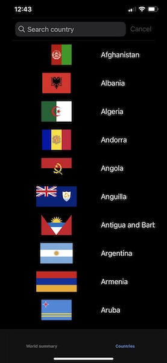

# covid-visualizer

iOS application created to visualize COVID-19 real-time data.

# App screens

The screens the app has look like the following images:

## World summary

## Countries list

## Country details

